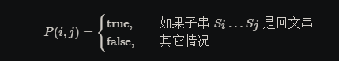

# 动态规划解法

对于一个子串而言，如果它是回文串，并且长度大于 22，那么将它首尾的两个字母去除之后，它仍然是个回文串。
例如对于字符串 `ababa`，如果我们已经知道`bab` 是回文串，那么`ababa`一定是回文串，
这是因为它的首尾两个字母都是`a`。

根据这样的思路，我们就可以用动态规划的方法解决本题。我们用 P(i,j) 表示字符串 s 的第 i 到 j 个字母
组成的串（下文表示成 s[i:j]）是否为回文串：

这里的「其它情况」包含两种可能性:
* s[i,j] 本身不是一个回文串；
* i>j，此时 s[i, j]s[i,j] 本身不合法

那么我们就可以写出动态规划的状态转移方程:

也就是说，只有 s[i+1:j-1]s[i+1:j−1] 是回文串，并且 ss 的第 ii 和 jj 个字母相同时，
s[i:j]s[i:j] 才会是回文串

上文的所有讨论是建立在子串长度大于 22 的前提之上的，我们还需要考虑动态规划中的边界条件，
即子串的长度为 11 或 22。对于长度为 11 的子串，它显然是个回文串；对于长度为 22 的子串，
只要它的两个字母相同，它就是一个回文串。因此我们就可以写出动态规划的边界条件：

根据这个思路，我们就可以完成动态规划了，最终的答案即为所有 P(i,j)=true 中
j-i+1（即子串长度）的最大值。
注意：在状态转移方程中，我们是从长度较短的字符串向长度较长的字符串进行转移的，
因此一定要注意动态规划的循环顺序。

